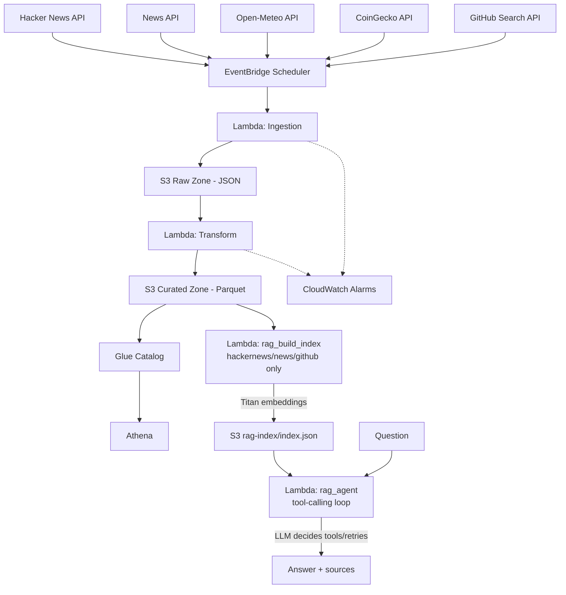

# Real-time Data Pipeline on AWS

Serverless ELT pipeline that ingests Hacker News stories, news articles,
weather observations, cryptocurrency prices, and trending GitHub repos,
correlates social buzz against real-world news, market moves, and dev
activity, and lands all five in an AWS data lake queryable via Athena.
Built as a portfolio project demonstrating the AWS/Python/SQL/IaC/CI-CD
skills for the Data Engineer Intern role at Cloud Kinetics.

## Architecture



- `ingestion/` -- Lambda functions that pull from Hacker News (public,
  no-auth API), NewsAPI, Open-Meteo (public, no-auth weather API for 4
  fixed Vietnam locations: TP.HCM, Vung Tau, Dong Nai, Da Lat), CoinGecko
  (public, no-auth price API for bitcoin/ethereum/solana), and GitHub's
  Search API (public, no-auth; a proxy for "trending" since GitHub has no
  official trending API -- repos created in the last 7 days, sorted by
  stars), normalize records, write newline-delimited JSON to the S3 raw
  zone.
- `transform/` -- Lambda triggered by new raw objects; cleans, dedups, extracts
  keywords, writes Parquet to the S3 curated zone.
- `rag/` -- on-demand serverless Agentic RAG over the curated zone (see
  [Agentic RAG](#agentic-rag) below).
- `common/` -- shared config/secrets/S3 helpers used by both.
- `infra/` -- Terraform for the buckets, Lambdas, EventBridge schedule, S3
  trigger, Secrets Manager, IAM roles, CloudWatch alarms, the Glue
  Catalog/Athena setup, and the RAG Lambdas/Bedrock permissions. See
  [`infra/README.md`](infra/README.md) for deploy steps.
- `infra-bootstrap/` -- one-time Terraform for the GitHub OIDC role CI/CD uses
  to reach AWS (no static keys). See
  [`infra-bootstrap/README.md`](infra-bootstrap/README.md).
- `.github/workflows/` -- `ci.yml` (lint + test + `terraform validate` on every
  PR/push) and `deploy.yml` (`terraform plan` then a manually-approved
  `terraform apply` on push to `main`).

## Local development

```bash
python3 -m venv .venv && source .venv/bin/activate
pip install -r requirements-dev.txt

cp .env.example .env   # DRY_RUN=true writes to ./local_output* instead of S3

pytest -q
ruff check .
```

Run a handler locally without any AWS resources:

```bash
DRY_RUN=true python -m ingestion.hackernews_ingestion  # no credentials needed
DRY_RUN=true python -m ingestion.news_ingestion
DRY_RUN=true python -m ingestion.weather_ingestion         # no credentials needed
DRY_RUN=true python -m ingestion.crypto_ingestion          # no credentials needed
DRY_RUN=true python -m ingestion.github_trending_ingestion # no credentials needed
```

(`news_ingestion` still needs a real `NEWS_SECRET_NAME` secret reachable via
Secrets Manager -- or a mocked `get_secret` -- since only the S3 write step
is stubbed by `DRY_RUN`. Hacker News', Open-Meteo's, CoinGecko's, and
GitHub's Search APIs are all public, so their ingestion needs no
credentials at all.)

## Deploying to AWS

1. Create a local-dev IAM user (one-time, via the AWS Console) -- see
   [`infra-bootstrap/README.md`](infra-bootstrap/README.md#step-0----create-a-local-dev-iam-user-one-time-via-the-aws-console).
2. Run [`infra-bootstrap/`](infra-bootstrap/README.md) once, with that user's
   credentials, to create the GitHub OIDC deploy role.
3. Push to `main` (or run `deploy.yml` via `workflow_dispatch`) to plan + apply
   [`infra/`](infra/README.md) through GitHub Actions.
4. Set the News API credentials in Secrets Manager (see `infra/README.md`).

## Sample analytics

`infra/glue.tf` registers a Glue database (`<project>_curated`) with five
tables -- `hackernews_stories`, `news_articles`, `weather_observations`,
`crypto_prices`, and `github_repos` -- over the curated zone, using Athena
partition projection (no crawler or `MSCK REPAIR TABLE` needed; queries
work immediately after `terraform apply`). Query them in the Athena console
under workgroup `<project>-analytics`. See
[`sql/sample_queries.sql`](sql/sample_queries.sql) for ready-to-run
examples, including ones that correlate Hacker News keywords against News
API keywords, crypto keyword mentions against that coin's same-day price
change, and trending GitHub repo keywords against Hacker News keywords on
the same day.

## Agentic RAG

`rag/` retrieves-and-generates over the curated zone using Amazon Bedrock --
no vector database (e.g. OpenSearch Serverless): at this dataset's size,
Lambda-memory cosine similarity is plenty, and it avoids a service that bills
24/7 even idle.

- `rag/build_index.py` (Lambda `<project>-rag-build-index`, on-demand): reads
  every curated Parquet record from the three text-bearing sources --
  `hackernews_stories`, `news_articles`, `github_repos` -- embeds each with
  Titan (`amazon.titan-embed-text-v2:0`), writes
  `s3://<curated-bucket>/rag-index/index.json`. `weather_observations` and
  `crypto_prices` are deliberately excluded from this semantic index:
  numeric telemetry with no natural-language text isn't a fit for
  embedding-based search -- the agent reaches that data through its own
  direct-read tools instead (below), not through `search_knowledge_base`.
  **Incremental**:
  caches by document id + text, so a re-run only embeds new/changed records
  (verified: a second run over the same 359 docs re-embedded 0, all served
  from cache).
- `rag/agent.py` (Lambda `<project>-rag-agent`, on-demand): a genuine
  **tool-calling agent** over Bedrock's **Converse API** -- the model gets
  four tools and on each turn decides for itself whether to call one, with
  what input, whether to reformulate and search again, or to stop and
  answer: `search_knowledge_base` (the semantic-search index above),
  `get_crypto_prices` and `get_weather` (real, live-ingested data read
  directly from the curated S3 zone -- the same numeric telemetry the
  index above deliberately excludes from semantic search, but exact and
  current, so these two tools are strictly more reliable than a web search
  for their narrow domains), and `search_web` (Tavily), the fallback for
  everything else. The loop runs until the model returns a plain text turn
  (no more tool calls) or `MAX_ITERATIONS` (6) is hit, at which point one
  final call asks for a best-effort answer with tools withdrawn. Every
  tool call is recorded in the response's `tool_calls` trace -- this isn't
  knowable in advance from the code; it's whatever the model chose to do
  for that specific question.

Verified live, two real runs against the same index:
- **In-domain** ("What is trending in AI safety and regulation right
  now?"): the agent called `search_knowledge_base` **three times** with
  three different reformulated queries before answering -- it wasn't told
  to retry, it decided the first results needed broadening. Answered with
  13 cited sources, all real URLs from the ingested corpus.
- **Out-of-domain** ("What's a good recipe for banh mi?"): the agent
  skipped the knowledge base entirely and called `search_web` directly on
  the first turn -- it inferred from the tool descriptions alone that this
  question wasn't a fit for the tech/news knowledge base, without any
  hardcoded domain check.

```bash
# 1. (Re)build the index after new data lands
aws lambda invoke --function-name realtime-data-pipeline-dev-rag-build-index \
  --cli-read-timeout 300 /tmp/out.json && cat /tmp/out.json

# 2. Ask a question
aws lambda invoke --function-name realtime-data-pipeline-dev-rag-agent \
  --cli-binary-format raw-in-base64-out \
  --payload '{"question": "What is trending in AI right now?"}' \
  --cli-read-timeout 90 \
  /tmp/agent-answer.json && cat /tmp/agent-answer.json
```

Anthropic models on Bedrock need one extra one-time step beyond enabling
"Model access": submitting the **use case details form** (Bedrock console ->
Model access/catalog -> the Anthropic model -> "Submit use case details").
Amazon's own models (Titan) don't need this. Allow up to ~15 minutes for it
to propagate before retrying.

### Evaluating it: RAGAS

`eval/run_ragas.py` scores the real agent pipeline (imported directly from
`rag/agent.py`, not mocked) on faithfulness, answer relevancy, and context
precision, judged by Bedrock. Dev-only tool (heavy `langchain`/`ragas`
deps, never deployed to Lambda) -- see [`eval/README.md`](eval/README.md)
for setup (the dependency pins matter -- `ragas`'s latest release has a
real import-compatibility bug) and how to read the results.

A real side-by-side comparison run over the 6 mixed in/out-of-domain
questions, from when this project still had both pipelines: the agent
scored `faithfulness: 0.8052`, `answer_relevancy: 0.9156`,
`llm_context_precision_without_reference: 0.5275`; the fixed
retrieve-then-generate pipeline (CRAG), before it was retired, scored
0.5474/0.5925/0.0000 on the same questions. That comparison's CRAG side
used only its local-knowledge-base path -- not the deployed Lambda's real
Tavily web-search fallback tier -- so treat it as a lower bound on what
CRAG could have scored, not a claim that CRAG had no web-search option at
all. The agent, by contrast, always had both `search_knowledge_base` and
`search_web` available as tools it could choose on every question in that
comparison (it has since gained `get_crypto_prices`/`get_weather` too, see
above -- neither existed yet at the time of this specific run), which the
numbers above still meaningfully favor it on. See
[`eval/README.md`](eval/README.md) for the latest run of today's
single-pipeline script (numbers move slightly run to run; the judge LLM
and the agent's own tool-use choices both have real variance).
