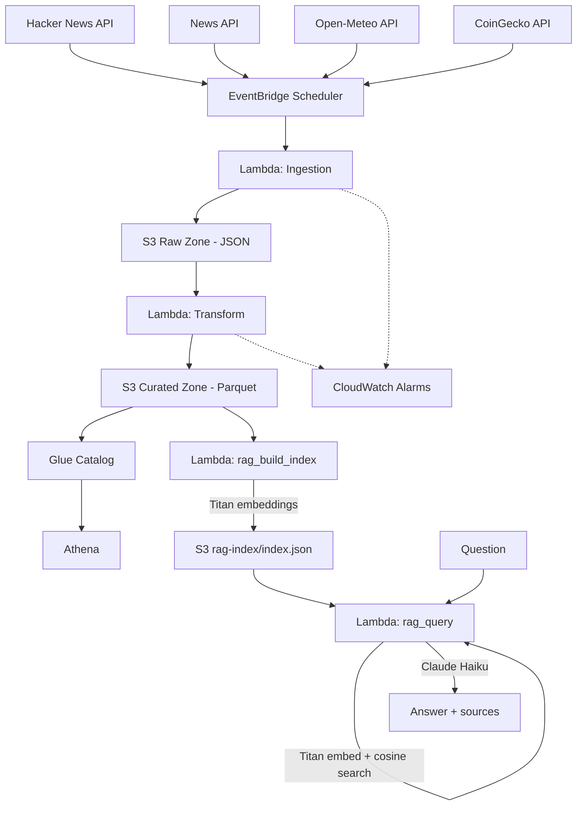

# Real-time Data Pipeline on AWS

Serverless ELT pipeline that ingests Hacker News stories, news articles,
weather observations, and cryptocurrency prices, correlates social buzz
against real-world news and market moves, and lands all four in an AWS data
lake queryable via Athena. Built as a portfolio project demonstrating the
AWS/Python/SQL/IaC/CI-CD skills for the Data Engineer Intern role at Cloud
Kinetics.

## Architecture



- `ingestion/` -- Lambda functions that pull from Hacker News (public,
  no-auth API), NewsAPI, Open-Meteo (public, no-auth weather API for 4
  fixed Vietnam locations: TP.HCM, Vung Tau, Dong Nai, Da Lat), and
  CoinGecko (public, no-auth price API for bitcoin/ethereum/solana),
  normalize records, write newline-delimited JSON to the S3 raw zone.
- `transform/` -- Lambda triggered by new raw objects; cleans, dedups, extracts
  keywords, writes Parquet to the S3 curated zone.
- `rag/` -- on-demand serverless RAG over the curated zone (see
  [Agentic RAG demo](#agentic-rag-demo) below).
- `common/` -- shared config/secrets/S3 helpers used by both.
- `infra/` -- Terraform for the buckets, Lambdas, EventBridge schedule, S3
  trigger, Secrets Manager, IAM roles, CloudWatch alarms, the Glue
  Catalog/Athena setup, and the RAG Lambdas/Bedrock permissions. See
  [`infra/README.md`](infra/README.md) for deploy steps.
- `infra-bootstrap/` -- one-time Terraform for the GitHub OIDC role CI/CD uses
  to reach AWS (no static keys). See
  [`infra-bootstrap/README.md`](infra-bootstrap/README.md).
- `.github/workflows/` -- `ci.yml` (lint + test + `terraform validate` on every
  PR/push) and `deploy.yml` (`terraform plan` then a manually-approved
  `terraform apply` on push to `main`).

## Local development

```bash
python3 -m venv .venv && source .venv/bin/activate
pip install -r requirements-dev.txt

cp .env.example .env   # DRY_RUN=true writes to ./local_output* instead of S3

pytest -q
ruff check .
```

Run a handler locally without any AWS resources:

```bash
DRY_RUN=true python -m ingestion.hackernews_ingestion  # no credentials needed
DRY_RUN=true python -m ingestion.news_ingestion
DRY_RUN=true python -m ingestion.weather_ingestion       # no credentials needed
DRY_RUN=true python -m ingestion.crypto_ingestion        # no credentials needed
```

(`news_ingestion` still needs a real `NEWS_SECRET_NAME` secret reachable via
Secrets Manager -- or a mocked `get_secret` -- since only the S3 write step
is stubbed by `DRY_RUN`. Hacker News', Open-Meteo's, and CoinGecko's APIs
are all public, so their ingestion needs no credentials at all.)

## Deploying to AWS

1. Create a local-dev IAM user (one-time, via the AWS Console) -- see
   [`infra-bootstrap/README.md`](infra-bootstrap/README.md#step-0----create-a-local-dev-iam-user-one-time-via-the-aws-console).
2. Run [`infra-bootstrap/`](infra-bootstrap/README.md) once, with that user's
   credentials, to create the GitHub OIDC deploy role.
3. Push to `main` (or run `deploy.yml` via `workflow_dispatch`) to plan + apply
   [`infra/`](infra/README.md) through GitHub Actions.
4. Set the News API credentials in Secrets Manager (see `infra/README.md`).

## Sample analytics

`infra/glue.tf` registers a Glue database (`<project>_curated`) with four
tables -- `hackernews_stories`, `news_articles`, `weather_observations`, and
`crypto_prices` -- over the curated zone, using Athena partition projection
(no crawler or `MSCK REPAIR TABLE` needed; queries work immediately after
`terraform apply`). Query them in the Athena console under workgroup
`<project>-analytics`. See [`sql/sample_queries.sql`](sql/sample_queries.sql)
for ready-to-run examples, including one that correlates Hacker News
keywords against News API keywords on the same day, and one that correlates
crypto keyword mentions against that coin's same-day price change.

## RAG demos: fixed pipeline + tool-calling agent

`rag/` retrieves-and-generates over the curated zone using Amazon Bedrock --
no vector database (e.g. OpenSearch Serverless): at this dataset's size,
Lambda-memory cosine similarity is plenty, and it avoids a service that bills
24/7 even idle. Two Lambdas answer questions over the same index, for
comparison:

- `rag/query.py` -- a **fixed pipeline**: retrieve, grade with CRAG, and
  fall back through 3 hardcoded tiers (local KB -> web search -> model
  knowledge). The orchestration logic lives in Python if/else branches; the
  LLM only grades and generates.
- `rag/agent.py` -- a genuine **tool-calling agent**: the LLM itself decides
  whether/when to call `search_knowledge_base` and `search_web`, how to
  reformulate the query, and when it has enough to answer -- via Bedrock's
  Converse API with function calling, not hardcoded branching. See
  [Agentic RAG: tool-calling agent](#agentic-rag-tool-calling-agent) below.

- `rag/build_index.py` (Lambda `<project>-rag-build-index`, on-demand): reads
  every curated Parquet record, embeds it with Titan (`amazon.titan-embed-text-v2:0`),
  writes `s3://<curated-bucket>/rag-index/index.json`. **Incremental**: caches
  by document id + text, so a re-run only embeds new/changed records (verified:
  a second run over the same 359 docs re-embedded 0, all served from cache).
- `rag/query.py` (Lambda `<project>-rag-query`, on-demand): embeds the
  question, does in-memory cosine similarity against that index, then runs
  **CRAG** (Corrective RAG) before generating, with a real 3-tier fallback:
  1. `grade_matches` -- one batched Claude Haiku call grades each retrieved
     doc `relevant` / `ambiguous` / `irrelevant` to the question.
  2. `classify_matches` -- keeps `relevant`/`ambiguous` docs, drops
     `irrelevant` ones (`discarded_low_relevance` in the response, for
     transparency).
  3. `choose_answer_source` picks where the answer comes from:
     - Anything survived grading -> **`local_knowledge_base`**: generate the
       normal cited answer (`grounded: true`).
     - Nothing survived -> **`web_search`**: search the web via Tavily and
       generate a cited answer from those results instead (`grounded:
       false`, but still sourced -- not a guess).
     - Web search also empty/failing -> **`model_knowledge`**: answer from
       Claude's own knowledge, explicitly flagged as unsourced.

  Verified all three branches live: an in-domain question ("AI safety")
  graded 5/5 relevant and cited the local dataset
  (`answer_source: local_knowledge_base`). An out-of-domain one ("Paris
  weather forecast") graded 5/5 local docs irrelevant, fell through to a
  real Tavily search, and answered from 5 real web results with URLs
  (`answer_source: web_search`) -- including correctly noting the sources
  disagreed with each other. Bedrock's own native Web Search tool exists
  but currently only supports OpenAI models on Bedrock, not Anthropic's, so
  this uses Tavily instead (a Secrets Manager secret, same pattern as
  NewsAPI) rather than switching model families for one fallback branch.

```bash
# 1. (Re)build the index after new data lands
aws lambda invoke --function-name realtime-data-pipeline-dev-rag-build-index \
  --cli-read-timeout 300 /tmp/out.json && cat /tmp/out.json

# 2. Ask a question
aws lambda invoke --function-name realtime-data-pipeline-dev-rag-query \
  --cli-binary-format raw-in-base64-out \
  --payload '{"question": "What is trending in AI right now?"}' \
  /tmp/answer.json && cat /tmp/answer.json
```

Anthropic models on Bedrock need one extra one-time step beyond enabling
"Model access": submitting the **use case details form** (Bedrock console ->
Model access/catalog -> the Anthropic model -> "Submit use case details").
Amazon's own models (Titan) don't need this. Allow up to ~15 minutes for it
to propagate before retrying.

### Agentic RAG: tool-calling agent

`rag/agent.py` (Lambda `<project>-rag-agent`, on-demand) replaces the fixed
CRAG branching above with a real agent loop over Bedrock's **Converse API**
tool use: the model gets two tools, `search_knowledge_base` (the local
index) and `search_web` (Tavily), and on each turn decides for itself
whether to call one, which query to search with, whether to reformulate and
search again, or to stop and answer. The loop runs until the model returns
a plain text turn (no more tool calls) or `MAX_ITERATIONS` (6) is hit, at
which point one final call asks for a best-effort answer with tools
withdrawn. Every tool call is recorded in the response's `tool_calls` trace
-- unlike the pipeline version, this isn't knowable in advance from the
code; it's whatever the model chose to do for that specific question.

Verified live, two real runs against the same index:
- **In-domain** ("What is trending in AI safety and regulation right
  now?"): the agent called `search_knowledge_base` **three times** with
  three different reformulated queries before answering -- it wasn't told
  to retry, it decided the first results needed broadening. Answered with
  13 cited sources, all real URLs from the ingested corpus.
- **Out-of-domain** ("What's a good recipe for banh mi?"): the agent
  skipped the knowledge base entirely and called `search_web` directly on
  the first turn -- it inferred from the tool descriptions alone that this
  question wasn't a fit for the tech/news knowledge base, without any
  hardcoded domain check.

```bash
aws lambda invoke --function-name realtime-data-pipeline-dev-rag-agent \
  --cli-binary-format raw-in-base64-out \
  --payload '{"question": "What is trending in AI right now?"}' \
  --cli-read-timeout 90 \
  /tmp/agent-answer.json && cat /tmp/agent-answer.json
```

### Evaluating it: RAGAS

`eval/run_ragas.py` scores the real retrieve -> CRAG -> generate pipeline
(imported directly from `rag/query.py`, not mocked) on faithfulness, answer
relevancy, and context precision, judged by Bedrock. Dev-only tool (heavy
`langchain`/`ragas` deps, never deployed to Lambda) -- see
[`eval/README.md`](eval/README.md) for setup (the dependency pins matter --
`ragas`'s latest release has a real import-compatibility bug) and how to
read the results.

Two clean runs over the 6 mixed in/out-of-domain questions:
`faithfulness: 0.44`, `answer_relevancy: 0.60-0.61`, `context_precision:
0.00-0.17` (near-zero both times). Faithfulness and relevancy tracked
CRAG's grounded/ungrounded split correctly (high on the 3 in-domain
questions, near-zero on the 3 out-of-domain ones). Context precision's
near-zero score is a **documented metric limitation, not a retrieval
bug** -- verified by direct testing it penalizes our answers' abstractive
multi-source synthesis style rather than measuring retrieval quality; see
[`eval/README.md`](eval/README.md#known-limitation-context-precision-reads-near-zero-here-verified-not-a-bug)
for the evidence.
