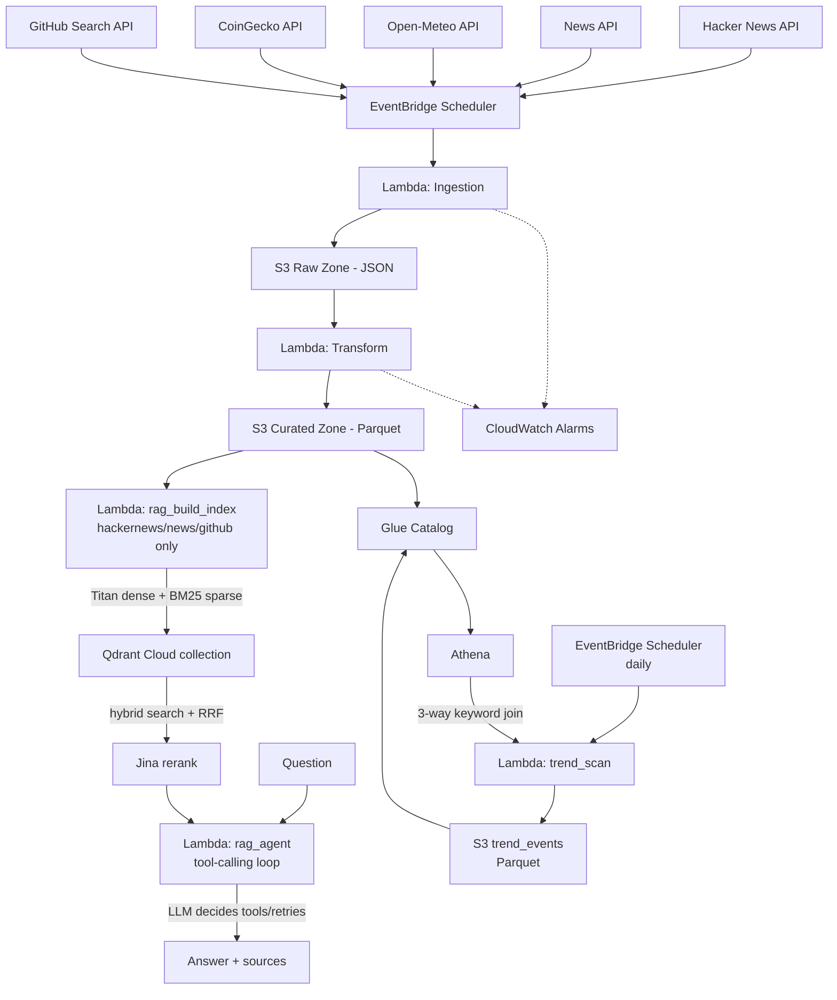
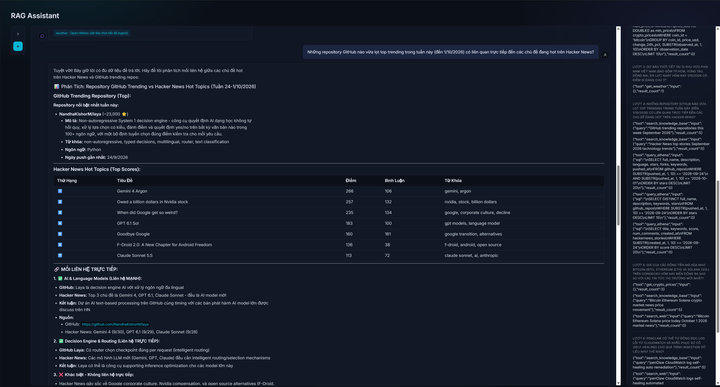

# Real-time Data Pipeline on AWS

Serverless ELT pipeline on AWS. It ingests Hacker News stories, news articles,
weather, crypto prices and trending GitHub repos, lands them in an S3 data lake
queryable with Athena, and adds an agentic RAG assistant on top.

**Live demo:** <https://realtime-data-pipeline.vercel.app/>

### Questions to try

The RAG Assistant page (or the `rag_agent` Lambda) takes free-form questions in
any language. The tool column is what the agent usually reaches for; it chooses
tools on its own, so the trace can differ.

| Question | Typical tool |
|---|---|
| What are people discussing about AI safety and regulation? | `search_knowledge_base` |
| Any interesting AI agent or developer tools mentioned recently? | `search_knowledge_base` |
| What are people saying about PostgreSQL on Hacker News? | `search_knowledge_base` |
| Summarize the latest news about the semiconductor industry. | `search_knowledge_base` |
| Are there recent repositories related to LangChain or LlamaIndex? | `search_knowledge_base` |
| What are the current prices of Bitcoin, Ethereum and Solana? | `get_crypto_prices` |
| Which of the three coins moved the most in the last 24 hours? | `get_crypto_prices` |
| If I had bought 10 SOL 24 hours ago, how much has my position changed in percent? | `get_crypto_prices` |
| Which tracked location is the hottest right now, and which is the most humid? | `get_weather` |
| What are the current conditions in Bien Hoa, and is it raining there right now? | `get_weather` |
| Which Rust projects were trending on GitHub recently? | `search_knowledge_base` + `query_athena` |
| Which Hacker News stories got the highest scores in the last 24 hours? | `query_athena` |
| Which five Hacker News authors posted the most stories in the past week? | `query_athena` |
| What was Bitcoin's average price per day over the last week? | `query_athena` |
| Which topics are trending on both Hacker News and GitHub today? | `query_athena` + `search_knowledge_base` |
| Has the crypto market moved a lot today, and is Hacker News discussing it? | `get_crypto_prices` + `search_knowledge_base` |
| Who won the most recent football World Cup? | `search_web` |
| Quel est le prix du Bitcoin aujourd'hui ? | `get_crypto_prices` (answers in French) |

## Architecture


```mermaid
flowchart TD
    A[Hacker News API] --> C[EventBridge Scheduler]
    B[News API] --> C
    W[Open-Meteo API] --> C
    P[CoinGecko API] --> C
    GH[GitHub Search API] --> C
    C --> D[Lambda: Ingestion]
    D --> E[S3 Raw Zone - JSON]
    E --> F[Lambda: Transform]
    F --> G[S3 Curated Zone - Parquet]
    G --> H[Glue Catalog]
    H --> I[Athena]
    D -.-> J[CloudWatch Alarms]
    F -.-> J

    G --> K[Lambda: rag_build_index<br/>hackernews/news/github only]
    K -->|Titan dense + BM25 sparse| L[Qdrant Cloud collection]

    Q[Question] --> AG[Lambda: rag_agent<br/>tool-calling loop]
    L -->|hybrid search + RRF| RR[Jina rerank]
    RR --> AG
    AG -->|LLM decides tools/retries| R2[Answer + sources]

    T[EventBridge Scheduler<br/>daily] --> TS[Lambda: trend_scan]
    I -->|3-way keyword join| TS
    TS --> TE[S3 trend_events<br/>Parquet]
    TE --> H
```

| Folder | What it does |
|---|---|
| `ingestion/` | One Lambda per source (Hacker News, NewsAPI, Open-Meteo for Vietnamese cities, CoinGecko for BTC/ETH/SOL, GitHub Search as a "trending" proxy. |
| `transform/` | Triggered by new raw objects: cleans, dedups, extracts keywords, writes Parquet to the curated zone. |
| `rag/` | On-demand agentic RAG over the curated zone (see [Agentic RAG](#agentic-rag)). |
| `trends/` | `trend_scan` (daily): finds keywords trending at the same time on GitHub, Hacker News and News API (distinct stories/articles/repos per keyword) and writes Trend Events, shown on the web app's `/trends` page. |
| `common/` | Shared config, secrets, S3 and HTTP helpers. |
| `infra/` | Terraform for everything above. See [`infra/README.md`](infra/README.md). |
| `infra-bootstrap/` | One-time Terraform for the GitHub OIDC role CI/CD uses (no static keys). See [`infra-bootstrap/README.md`](infra-bootstrap/README.md). |
| `.github/workflows/` | `ci.yml`: lint, tests, `terraform validate`. `deploy.yml`: `terraform plan`, then a manually approved `apply` on push to `main`. |
| `web/` | Next.js app (dashboard, RAG assistant, explorer, ops, trends, cicd, weather). |
| `scripts/` | `build_lambdas.sh` packages the Lambdas; `telegram_*.sh` are the OpenClaw push automations (see [OpenClaw](#openclaw-ops-agent)). |

## Local development

```bash
python3 -m venv .venv && source .venv/bin/activate
pip install -r requirements-dev.txt
cp .env.example .env   # DRY_RUN=true writes to ./local_output* instead of S3
pytest -q
ruff check .
```

Run a handler locally with no AWS resources:

```bash
DRY_RUN=true python -m ingestion.hackernews_ingestion   # also weather, crypto, github_trending
DRY_RUN=true python -m ingestion.news_ingestion         # needs NEWS_SECRET_NAME reachable
```

`DRY_RUN` only stubs the S3 write. Every source except NewsAPI is a public
API, so it needs no credentials.

## Deploying to AWS

1. Create a local-dev IAM user (one-time) -- see
   [`infra-bootstrap/README.md`](infra-bootstrap/README.md#step-0----create-a-local-dev-iam-user-one-time-via-the-aws-console).
2. Run [`infra-bootstrap/`](infra-bootstrap/README.md) once with that user to
   create the GitHub OIDC deploy role.
3. Push to `main` (or run `deploy.yml` manually) to plan and apply
   [`infra/`](infra/README.md).
4. Set the News API, Tavily, Qdrant Cloud and Jina keys in Secrets Manager (see `infra/README.md`).

## Ingestion performance

**What changed.** Two ingestion Lambdas fetched many URLs one after another
-- Hacker News 50 stories, weather 12 cities. They now fetch up to 10 at the
same time (`common/http.py`). Same data, same order; one failed request still
fails the run.

**Result** (time of one run on the real Lambda):

| Lambda | Sequential | Concurrent | Faster |
|---|---|---|---|
| `hackernews_ingestion` (50 requests) | 5.1s typical, 7.0s slow runs | 1.8s typical | ~3x |
| `weather_ingestion` (12 requests) | 6.2s typical, 11.8s slow runs | 0.7s typical | ~9x |

"Typical" is the median (p50); "slow runs" is p95. Before = CloudWatch, the
144 scheduled runs of the 3 days up to 2026-10-01. After = 5 manual runs of
each function right after the deploy. A back-to-back test on one machine
against the live APIs points the same way (Hacker News 60-77s -> 3-4s,
weather 20-26s -> 1.4-2.1s), with bigger ratios only because that machine
had a slow network.

**Conclusion.** Fetching at the same time makes weather about 9x faster and
Hacker News about 3x faster, with identical results and no extra cost
(Lambda bills by run time, so shorter is cheaper). Weather's worst run
before was 30.7s against a 60s timeout; after, 2.0s.

**Why.** One after another, the total is the *sum* of every request (for
weather: 12 requests x ~0.5s = ~6s). At the same time, the total is about
the *slowest single* request (~0.7s). Hacker News gains less because it has
work that cannot be parallelised: it must first fetch the list of story ids,
and at the end it writes to S3; one slow story also holds up the whole run.

## Sample analytics

`infra/glue.tf` registers a Glue database (`<project>_curated`) with five
tables (`hackernews_stories`, `news_articles`, `weather_observations`,
`crypto_prices`, `github_repos`) using Athena partition projection. Query them in the Athena console
under workgroup `<project>-analytics`. [`sql/sample_queries.sql`](sql/sample_queries.sql)
has ready-to-run examples, e.g. Hacker News vs News API keywords, crypto
mentions vs same-day price change, GitHub vs Hacker News keywords.

## Agentic RAG

`rag/` answers questions over the curated zone with Amazon Bedrock. Vectors
live in a Qdrant Cloud collection (free tier), so the Lambda no longer loads
the whole index into memory.

- **`rag/build_index.py`** (every 6 hours): embeds every record from the three
  text sources (`hackernews_stories`, `news_articles`, `github_repos`) with
  Titan (`amazon.titan-embed-text-v2:0`) and upserts it into Qdrant.
  Weather and crypto are numeric and not worth embedding; the agent reads them with its own tools.
  It is incremental: it skips documents whose text hash and embedding model.
- **`rag/agent.py`** (on-demand): a tool-calling agent on Bedrock's Converse
  API. On each turn the model decides whether to call a tool, with what input,
  whether to search again, or to answer. Tools:
  - `search_knowledge_base`: hybrid search + RRF in Qdrant, then a Jina rerank of the top 30 down to 5.
  - `get_crypto_prices`, `get_weather`: exact, current data read from the curated zone.
  - `query_athena`: read-only SQL for aggregates (averages, counts, time windows).
  - `search_web` (Tavily): search out-domain questions on Internet, fallback for everything else.

  The loop ends when the model answers in plain text, or after `MAX_ITERATIONS`
  (6), when one last call asks for a best-effort answer with tools withdrawn.
  Every tool call is returned in the `tool_calls` trace.

Checked live: an in-domain question ("What is trending in AI safety and
regulation?") made the agent search the knowledge base 3 times with different
queries and cite 13 real sources; an out-of-domain one (a banh mi recipe) went
straight to `search_web`, with no hardcoded domain check.

```bash
# 1. (Re)build the vector collection after new data lands
aws lambda invoke --function-name realtime-data-pipeline-dev-rag-build-index \
  --cli-read-timeout 300 /tmp/out.json && cat /tmp/out.json

# 2. Ask an in-domain question
aws lambda invoke --function-name realtime-data-pipeline-dev-rag-agent \
  --cli-binary-format raw-in-base64-out \
  --payload '{"question": "What is trending in AI right now?"}' \
  --cli-read-timeout 90 /tmp/agent-answer.json && cat /tmp/agent-answer.json

# 3. Ask an out-domain question
aws lambda invoke --function-name realtime-data-pipeline-dev-rag-agent \
  --cli-binary-format raw-in-base64-out \
  --payload '{"question": "What is a banh mi recipe?"}' \
  --cli-read-timeout 90 /tmp/agent-answer.json && cat /tmp/agent-answer.json
```

### Example

A cross-source question asked on the web app's RAG Assistant page. The agent
combined GitHub trending repos with Hacker News topics and returned a table.
The right-hand panel shows the tool calls it made (knowledge base search plus
Athena queries).



### Limitation:

- **Weather** is the current observation at 12 locations (11 in southern
  Vietnam plus Da Lat), not a forecast.
- **Crypto** covers Bitcoin, Ethereum and Solana only. The 24-hour change comes
  from CoinGecko; for any other time window the agent has to query the history.
- **Time** ("today", "this week", "this month") is resolved against the current
  UTC date, and history only goes back to when ingestion started, so an early
  "since the start of the month" answer can be incomplete.
- **Read-only:** `query_athena` accepts a single `SELECT`, so a request related to delete or update data cannot run.
- **Privacy**: The private Gmail table has no tool, so questions about emails cannot be answered.
- **Repeats:** an identical question can be served from the answer cache (the
  response then has `"cached": true`).

### Evaluation (RAGAS)

`eval/run_ragas.py` scores the real agent on faithfulness, answer relevancy
and context precision, judged by Bedrock. It is dev-only (heavy `ragas` /
`langchain` dependencies, never deployed). Setup, dependency pins and the
latest numbers are in [`eval/README.md`](eval/README.md).

### Retrieval upgrade (hybrid search + rerank)

**What changed.** 
Instead of loading a 27 MB `index.json` from S3 and compare vectors in Lambda memory,
it now uses hybrid search from Qdrant Cloud (Titan meaning-based and BM25 keyword-based), 
merges them with Reciprocal Rank Fusion, and a Jina reranker picks the final 5. 

**Source:** [`Qdrant Cloud`](<https://qdrant.tech/cloud/>), [`Jina`](<https://jina.ai/>), [`Hybrid Search`](<https://qdrant.tech/course/essentials/day-3/hybrid-search-demo/>).

**Result** (12 questions, same agent and model, same 1,158 documents in all three stages):

| Stage | Faithfulness | Answer relevancy | Context precision | Search p50 |
|---|---|---|---|---|
| 1. Cosine on `index.json` (before) | 0.676 | 0.729 | 0.385 | 672 ms (+ 12.3 s index load) |
| 2. Hybrid + RRF | 0.681 | 0.611 | 0.462 | 1,338 ms |
| 3. Hybrid + RRF + rerank | 0.705 | 0.666 | 0.300 | 2,505 ms |

**Conclusion.** 
Hybrid search raised context precision (0.385 to 0.462) and rerank raised
faithfulness (0.676 to 0.705), but neither stage beat the old index on every metric: answer relevancy fell in both, context precision fell with rerank, and search got slower.

**Why.**
- Keyword search finds exact names the meaning-based search blurs, and the merge keeps what either retriever ranks high, which is why stage 2 retrieved more relevant passages.
- The reranker reads question and passage together, but in this run it also made the agent answer the out-of-domain pho question without sources, which the context-precision judge scores as 0 even though not answering is the right behaviour. Search is slower because it is now a network
call to Qdrant (about 1.3 s from a laptop, Titan query embedding included) and rerank adds a second one to Jina (about 1.2 s more).

**Benefits.**
The real gain is scale: the old index could not load past about
1.4k documents in a 512 MB Lambda, while Qdrant now holds all 34,977 documents and adds new ones incrementally. Rerank costs roughly $0.0004 per search (about 30 passages x 250 tokens at $0.05 per million tokens, an estimate), within Jina's free allowance.

## Rerank minimum score

**What changed.** The reranker used to return its top 5 passages no matter how weak they were.
It now drops any passage whose Jina score is below 0.15 (returning nothing when none qualify),
Jina truncates long documents itself (`max_doc_length`), and the agent reads the whole passage
instead of its first 300 characters.

**Result** (same 12 questions, same agent and model):

| | Before (rerank, no cutoff) | After (cutoff 0.15) |
|---|---|---|
| Faithfulness | 0.705 | 0.646 |
| Answer relevancy | 0.666 | 0.710 |
| Context precision | 0.300 | 0.408 |
| Passages the agent got, per question | 7.5 | 4.2 |

**Conclusion.** 
The cutoff cut the passages per question from 7.5 to 4.2 and context precision
rose in both runs I made (0.300 to 0.408, and 0.507 in a first run with a broken Athena setting); faithfulness fell (0.705 to 0.646), but run-to-run swings are larger than that.

**Why.** 
- Fewer weak passages reach the judge, which is what the cutoff is for: the PostgreSQL question went from 5 passages to 1.
- The other metrics move for reasons unrelated to the change:
the out-of-domain 'pho' question flips between refusing (scored 0 on everything) and answering from the web (scored high) from one run to the next, and the judge gave the same single passage a precision of 1.0 in one run and 0.0 in the next.

## OpenClaw ops agent

[OpenClaw](https://github.com/openclaw/openclaw) is a self-hosted personal AI
agent that runs on the dev machine and doubles as the ops agent for this repo
(its working directory is the repo root). It is not deployed to AWS and the
pipeline does not depend on it.

**What it does**
- **Scheduled Telegram pushes.** Five cron jobs run the `scripts/telegram_*.sh`
  scripts, which read the curated zone (or call a Lambda) and send the result to
  one Telegram chat. Cron times are UTC.

  | Job | When | Sends |
  |---|---|---|
  | Trend digest | 23:30 | Today's trending keywords (`trend_events`); silent if none |
  | Daily brief | 00:00 (07:00 ICT) | Weather for 12 locations, BTC/ETH/SOL, top 3 GitHub trending |
  | FinOps alert | 01:00 | Yesterday's AWS cost, only if above 1.5x the previous 7-day average |
  | Data observability | 01:30 | Null rates per table, missing weather locations |
  | RAG briefing | 16:00 (23:00 ICT) | A `rag_agent` answer with its sources; one Bedrock call per day |
- **Ops tasks on request:** run local tests with `DRY_RUN=true`, query Athena,
  read logs when a CloudWatch alarm fires, summarise a `terraform plan`, and
  answer news questions through the `rag_agent` Lambda.

**Guardrails.** The agent's rules live in its own `AGENTS.md`, outside this
repo. The main ones: it never runs `terraform apply`, never disables or deletes
AWS resources without asking first (pausing is done with
`aws events disable-rule`, never by editing Terraform), and never prints
secrets. Terraform changes follow *apply locally, then commit and push*. These
are instructions to a model, not enforced permissions. In one test the agent
edited a `.tf` file instead of asking; nothing was applied, and the rule was
tightened afterwards.

**Setup.** Install OpenClaw, pair a Telegram bot, then register each script as
a cron job with `TELEGRAM_TARGET=<chat id>` set. Secrets (bot token, gateway
token) are stored by OpenClaw, never in this repo.
