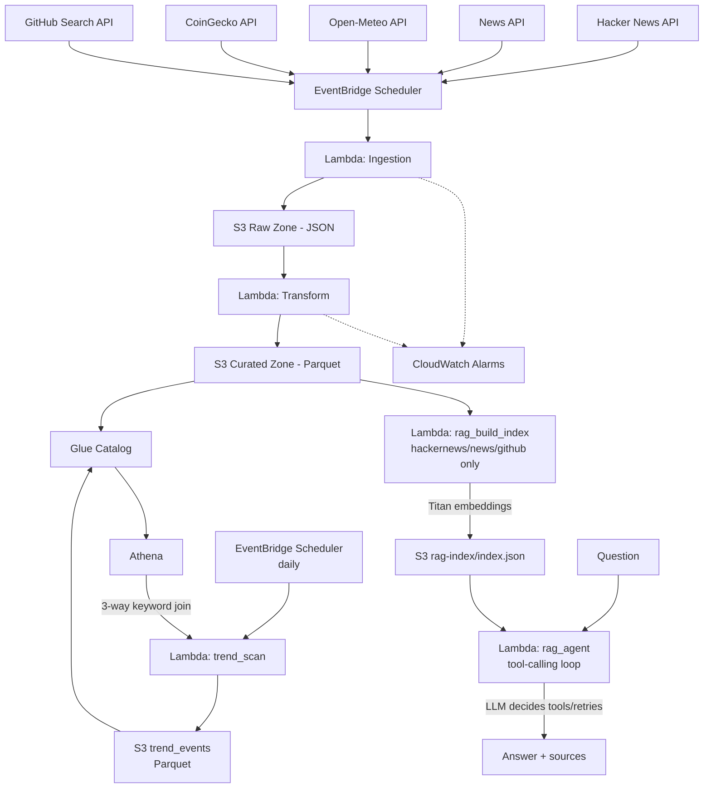

# Real-time Data Pipeline on AWS

Serverless ELT pipeline on AWS. It ingests Hacker News stories, news articles,
weather, crypto prices and trending GitHub repos, lands them in an S3 data lake
queryable with Athena, and adds an agentic RAG assistant on top.

## Architecture


```mermaid
flowchart TD
    A[Hacker News API] --> C[EventBridge Scheduler]
    B[News API] --> C
    W[Open-Meteo API] --> C
    P[CoinGecko API] --> C
    GH[GitHub Search API] --> C
    C --> D[Lambda: Ingestion]
    D --> E[S3 Raw Zone - JSON]
    E --> F[Lambda: Transform]
    F --> G[S3 Curated Zone - Parquet]
    G --> H[Glue Catalog]
    H --> I[Athena]
    D -.-> J[CloudWatch Alarms]
    F -.-> J

    G --> K[Lambda: rag_build_index<br/>hackernews/news/github only]
    K -->|Titan embeddings| L[S3 rag-index/index.json]

    Q[Question] --> AG[Lambda: rag_agent<br/>tool-calling loop]
    L --> AG
    AG -->|LLM decides tools/retries| R2[Answer + sources]

    T[EventBridge Scheduler<br/>daily] --> TS[Lambda: trend_scan]
    I -->|3-way keyword join| TS
    TS --> TE[S3 trend_events<br/>Parquet]
    TE --> H
```

| Folder | What it does |
|---|---|
| `ingestion/` | One Lambda per source (Hacker News, NewsAPI, Open-Meteo for Vietnamese cities, CoinGecko for BTC/ETH/SOL, GitHub Search as a "trending" proxy: repos created in the last 7 days, by stars). Writes newline-delimited JSON to the raw zone. Only NewsAPI needs a key. |
| `transform/` | Triggered by new raw objects: cleans, dedups, extracts keywords, writes Parquet to the curated zone. |
| `rag/` | On-demand agentic RAG over the curated zone (see [Agentic RAG](#agentic-rag)). |
| `trends/` | `trend_scan` (daily): finds keywords trending at the same time on GitHub, Hacker News and News API (distinct stories/articles/repos per keyword) and writes Trend Events, shown on the web app's `/trends` page. |
| `common/` | Shared config, secrets, S3 and HTTP helpers. |
| `infra/` | Terraform for everything above. See [`infra/README.md`](infra/README.md). |
| `infra-bootstrap/` | One-time Terraform for the GitHub OIDC role CI/CD uses (no static keys). See [`infra-bootstrap/README.md`](infra-bootstrap/README.md). |
| `.github/workflows/` | `ci.yml`: lint, tests, `terraform validate`. `deploy.yml`: `terraform plan`, then a manually approved `apply` on push to `main`. |
| `web/` | Next.js app (dashboard, RAG assistant, explorer, ops, trends, ...). |
| `scripts/` | `build_lambdas.sh` packages the Lambdas; `telegram_*.sh` are the OpenClaw push automations (see [OpenClaw](#openclaw-ops-agent)). |

## Local development

```bash
python3 -m venv .venv && source .venv/bin/activate
pip install -r requirements-dev.txt
cp .env.example .env   # DRY_RUN=true writes to ./local_output* instead of S3
pytest -q
ruff check .
```

Run a handler locally with no AWS resources:

```bash
DRY_RUN=true python -m ingestion.hackernews_ingestion   # also weather, crypto, github_trending
DRY_RUN=true python -m ingestion.news_ingestion         # needs NEWS_SECRET_NAME reachable
```

`DRY_RUN` only stubs the S3 write. Every source except NewsAPI is a public
API, so it needs no credentials.

## Deploying to AWS

1. Create a local-dev IAM user (one-time) -- see
   [`infra-bootstrap/README.md`](infra-bootstrap/README.md#step-0----create-a-local-dev-iam-user-one-time-via-the-aws-console).
2. Run [`infra-bootstrap/`](infra-bootstrap/README.md) once with that user to
   create the GitHub OIDC deploy role.
3. Push to `main` (or run `deploy.yml` manually) to plan and apply
   [`infra/`](infra/README.md).
4. Set the News API and Tavily keys in Secrets Manager (see `infra/README.md`).

## Ingestion performance

**What changed.** Two ingestion Lambdas fetched many URLs one after another
-- Hacker News 50 stories, weather 12 cities. They now fetch up to 10 at the
same time (`common/http.py`). Same data, same order; one failed request still
fails the run.

**Result** (time of one run on the real Lambda):

| Lambda | Sequential (before) | Concurrent (after) | Faster |
|---|---|---|---|
| `hackernews_ingestion` (50 requests) | 5.1 s typical, 7.0 s slow runs | 1.8 s typical | ~3x |
| `weather_ingestion` (12 requests) | 6.2 s typical, 11.8 s slow runs | 0.7 s typical | ~9x |

"Typical" is the median (p50); "slow runs" is p95. Before = CloudWatch, the
144 scheduled runs of the 3 days up to 2026-10-01. After = 5 manual runs of
each function right after the deploy. A back-to-back test on one machine
against the live APIs points the same way (Hacker News 60-77 s -> 3-4 s,
weather 20-26 s -> 1.4-2.1 s), with bigger ratios only because that machine
had a slow network.

**Conclusion.** Fetching at the same time makes weather about 9x faster and
Hacker News about 3x faster, with identical results and no extra cost
(Lambda bills by run time, so shorter is cheaper). Weather's worst run
before was 30.7 s against a 60 s timeout; after, 2.0 s.

**Why.** One after another, the total is the *sum* of every request (for
weather: 12 requests x ~0.5 s = ~6 s). At the same time, the total is about
the *slowest single* request (~0.7 s). Hacker News gains less because it has
work that cannot be parallelised: it must first fetch the list of story ids,
and at the end it writes to S3; one slow story also holds up the whole run.

**Caveat.** The "after" numbers are only 5 runs per function, so there is no
p95 yet. It will be added once enough scheduled runs have accumulated.

## Sample analytics

`infra/glue.tf` registers a Glue database (`<project>_curated`) with five
tables (`hackernews_stories`, `news_articles`, `weather_observations`,
`crypto_prices`, `github_repos`) using Athena partition projection, so no
crawler or `MSCK REPAIR TABLE` is needed. Query them in the Athena console
under workgroup `<project>-analytics`. [`sql/sample_queries.sql`](sql/sample_queries.sql)
has ready-to-run examples, e.g. Hacker News vs News API keywords, crypto
mentions vs same-day price change, GitHub vs Hacker News keywords.

## Agentic RAG

`rag/` answers questions over the curated zone with Amazon Bedrock. There is
no vector database: at this size, cosine similarity in Lambda memory is enough
and avoids a service that bills 24/7.

- **`rag/build_index.py`** (on-demand): embeds every record from the three
  text sources (`hackernews_stories`, `news_articles`, `github_repos`) with
  Titan (`amazon.titan-embed-text-v2:0`) into `s3://<curated-bucket>/rag-index/index.json`.
  Weather and crypto are numeric and not worth embedding; the agent reads them
  with its own tools. It is incremental: it caches by document id + text, so a
  re-run only embeds new or changed records.
- **`rag/agent.py`** (on-demand): a tool-calling agent on Bedrock's Converse
  API. On each turn the model decides whether to call a tool, with what input,
  whether to search again, or to answer. Tools:
  - `search_knowledge_base`: semantic search over the index.
  - `get_crypto_prices`, `get_weather`: exact, current data read from the curated zone.
  - `query_athena`: read-only SQL for aggregates (averages, counts, time
    windows), with the same SELECT-only guard as the web Data Explorer.
  - `search_web` (Tavily): fallback for everything else.

  The loop ends when the model answers in plain text, or after `MAX_ITERATIONS`
  (6), when one last call asks for a best-effort answer with tools withdrawn.
  Every tool call is returned in the `tool_calls` trace.

Checked live: an in-domain question ("What is trending in AI safety and
regulation?") made the agent search the knowledge base 3 times with different
queries and cite 13 real sources; an out-of-domain one (a banh mi recipe) went
straight to `search_web`, with no hardcoded domain check.

```bash
# 1. (Re)build the index after new data lands
aws lambda invoke --function-name realtime-data-pipeline-dev-rag-build-index \
  --cli-read-timeout 300 /tmp/out.json && cat /tmp/out.json

# 2. Ask a question
aws lambda invoke --function-name realtime-data-pipeline-dev-rag-agent \
  --cli-binary-format raw-in-base64-out \
  --payload '{"question": "What is trending in AI right now?"}' \
  --cli-read-timeout 90 /tmp/agent-answer.json && cat /tmp/agent-answer.json
```

Anthropic models on Bedrock need one extra one-time step beyond "Model
access": submit the **use case details form** (Bedrock console -> Model
catalog -> the model -> "Submit use case details") and wait up to ~15 minutes.
Titan does not need it.

### Evaluation (RAGAS)

`eval/run_ragas.py` scores the real agent on faithfulness, answer relevancy
and context precision, judged by Bedrock. It is dev-only (heavy `ragas` /
`langchain` dependencies, never deployed). Setup, dependency pins and the
latest numbers are in [`eval/README.md`](eval/README.md).

## OpenClaw ops agent

[OpenClaw](https://github.com/openclaw/openclaw) is a self-hosted personal AI
agent that runs on the dev machine and doubles as the ops agent for this repo
(its working directory is the repo root). It is not deployed to AWS and the
pipeline does not depend on it.

**What it does**
- **Scheduled Telegram pushes.** Five cron jobs run the `scripts/telegram_*.sh`
  scripts, which read the curated zone (or call a Lambda) and send the result to
  one Telegram chat. Cron times are UTC.

  | Job | When | Sends |
  |---|---|---|
  | Trend digest | 23:30 | Today's trending keywords (`trend_events`); silent if none |
  | Daily brief | 00:00 (07:00 ICT) | Weather for 12 locations, BTC/ETH/SOL, top 3 GitHub trending |
  | FinOps alert | 01:00 | Yesterday's AWS cost, only if above 1.5x the previous 7-day average |
  | Data observability | 01:30 | Null rates per table, missing weather locations |
  | RAG briefing | 16:00 (23:00 ICT) | A `rag_agent` answer with its sources; one Bedrock call per day |
- **Ops tasks on request:** run local tests with `DRY_RUN=true`, query Athena,
  read logs when a CloudWatch alarm fires, summarise a `terraform plan`, and
  answer news questions through the `rag_agent` Lambda.

**Guardrails.** The agent's rules live in its own `AGENTS.md`, outside this
repo. The main ones: it never runs `terraform apply`, never disables or deletes
AWS resources without asking first (pausing is done with
`aws events disable-rule`, never by editing Terraform), and never prints
secrets. Terraform changes follow *apply locally, then commit and push*. These
are instructions to a model, not enforced permissions. In one test the agent
edited a `.tf` file instead of asking; nothing was applied, and the rule was
tightened afterwards.

**Setup.** Install OpenClaw, pair a Telegram bot, then register each script as
a cron job with `TELEGRAM_TARGET=<chat id>` set. Secrets (bot token, gateway
token) are stored by OpenClaw, never in this repo.
